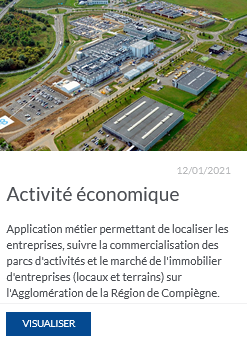

# Documentation d'administration de l'application #

* Statut
  - [x] à rédiger
  - [ ] en cours de rédaction
  - [ ] relecture
  - [ ] finaliser
  - [ ] révision

# Généralité

|Représentation| Nom de l'application |Résumé|
|:---|:---|:---|
||Activité économique|Cette application est dédiée à la consultation des données et à la gestion des données en lien avec l'activité économique (suivi des sites d'activités, de la commercialisation des terrains à vocation économique, des établissements, gestion d'un fichier de contacts, connaissance des bâtiments et locaux d'activité, suivi du marché immobilier.|

# Accès

|Public|Métier|Accès restreint|
|:-:|:-:|:---|
||X|Seule le service du développement économique peut modifier les données (en fonction du profil utilisateur des agents), les autres services ont un accès en lecture.|

# Droit par profil de connexion

* **Prestataires**

Sans Objet

* **Personnes du service métier**

|Fonctionnalités|Lecture|Ecriture|Précisions|
|:---|:-:|:-:|:---|
|Toutes|x||L'ensemble des fonctionnalités (recherches, cartographie, fiches d'informations, ...) sont accessibles par tous les utilisateurs connectés.|
|||||

* **Autres profils**

Sans objet

# Les données

Sont décrites ici les Géotables et/ou Tables intégrées dans GEO pour les besoins de l'application. Les autres données servant d'habillage (pour la cartographie ou les recherches) sont listées dans les autres parties ci-après. Le tableau ci-dessous présente uniquement les changements (type de champ, formatage du résultat, ...) ou les ajouts (champs calculés, filtre, ...) non présents dans la donnée source. 

## GeoTable : `nom`

|Attributs| Champ calculé | Formatage |Renommage|Particularité/Usage|Utilisation|Exemple|
|:---|:-:|:-:|:---|:---|:---|:---|

   * filtres :

|Nom|Attribut| Au chargement | Type | Condition |Valeur|Description|
|:---|:---|:-:|:---:|:---:|:---|:---|
   
   * relations :

|Géotables ou Tables| Champs de jointure | Type |
|:---|:---|:---|

   * particularité(s) : aucune

   
## Table : `nom`

|Attributs| Champ calculé | Formatage |Renommage|Particularité/Usage|Utilisation|Exemple|
|:---|:-:|:-:|:---|:---|:---|:---|

   * filtres : aucun
   * relations :

|Géotables ou Tables| Champs de jointure | Type |
|:---|:---|:---|

   * particularité(s) : aucune
   

# Les fonctionnalités

Sont présentées ici uniquement les fonctionnalités spécifiques à l'application.

## Recherche globale : `nom`

Cette recherche permet à l'utilisateur de faire une recherche libre sur le libellé d'une voie.

* Configuration :

Source : `nom`

|Attribut|Afficher|Rechercher|Suggestion|Attribut de géométrie|Tri des résultats|
|:---|:-:|:-:|:-:|:-:|:-:|

(Calcul des suggestions par "Contient les mots entiers")
(la détection des doublons n'est pas activée ici)

 * Filtres : aucun

 * Fiches d'information active : nom
 

## Recherche (clic sur la carte) : `nom`

Cette recherche permet à l'utilisateur de cliquer sur la carte et de remonter les informations de l'adresse.

  * Configuration :

Source : `nom`

|Attribut|Afficher|Rechercher|Suggestion|Attribut de géométrie|Tri des résultats|
|:---|:-:|:-:|:-:|:-:|:-:|

(Calcul des suggestions par "Contient les mots entiers")
(la détection des doublons n'est pas activée ici)

 * Filtres : aucun

 * Fiches d'information active : nom
 

## Recherche : `Toutes les recherches cadastrales`

L'ensemble des recherches cadastrales ont été formatées et intégrées par l'éditeur via son module GeoCadastre.
Seul le nom des certaines recherches a été modifié par l'ARC pour plus de compréhension des utilisateurs.

Cette recherche est détaillée dans le répertoire GitHub [docurba](https://github.com/sigagglocompiegne/docurba).

## Recherche : `nom`

Cette recherche permet à l'utilisateur de.

  * Configuration :

Source : `nom`

|Attribut|Afficher|Rechercher|Suggestion|Attribut de géométrie|Tri des résultats|
|:---|:-:|:-:|:-:|:-:|:-:|

(Calcul des suggestions par "Contient la chaine")
(la détection des doublons n'est pas activée ici)

 * Filtres :

|Groupe|Jointure|Filtres liés|
|:---|:-:|:-:|
|Groupe de filtres par défaut|`ET`|x|

|Nom|Obligatoire|Attribut|Condition|Valeur|Champ d'affichage (1)|Champ de valeurs (1)|Champ de tri (1)|Ajout autorisé (1)|Particularités|
|:---|:-:|:---|:---|:---|:---|:---|:---|:-:|:---|

(1) si liste de domaine

 * Fiches d'information active : nom
 

## Fiche d'information : `nom`

Source : `nom`

* Statistique : aucune
 
 * Représentation :
 
|Mode d'ouverture|Taille|Agencement des sections|
|:---|:---|:---|
|dans le gabarit|530x650|Vertical|

|Nom de la section|Attributs|Position label|Agencement attribut|Visibilité conditionnelle|Fichie liée|Ajout de données autorisé|
|:---|:---|:---|:---|:---|:---|:---|

 * Saisie : aucune

 * Modèle d'impression : nom

 
## Analyse :

Aucune

## Statistique :

Aucune

## Modification géométrique : `nom`

Cette recherche permet à l'utilisateur de saisir .

  * Configuration :
  
Source : `nom`

 * Filtres : aucun
 * Accrochage : aucun
 * Fiches d'information active : nom
 * Topologie : aucune 
 
 # La cartothèque

|Groupe|Sous-groupe|Visible dans la légende|Visible au démarrage|Détails visibles|Déplié par défaut|Geotable|Renommée|Issue d'une autre carte|Visible dans la légende|Visible au démarrage|Déplié par défaut|Couche sélectionnable|Couche accrochable|Catégorisation|Seuil de visibilité|Symbologie|Autres|
|:---|:---|:-:|:-:|:-:|:-:|:---|:---|:-:|:-:|:-:|:-:|:-:|:---|:---|:---|:---|:---|

# L'application

* Généralités :

|Gabarit|Thème|Modules spé|Impression|Résultats|
|:---|:---|:---|:---|:---|

* Particularité de certains modules :
  * Module introduction :
  * Module javacript : 
  * Module Export Fonctionnalité : ce module permet l'export des données issues de recherche

|Type d'export|
|:---|
|D'après la liste|

|Fonctionnalités exportables|
|:---|

* Recherche globale :

|Noms|Tri|Nb de sugggestion|Texte d'invite|
|:---|:---|:---|:---|

* Carte : `nom`

Comportement au clic : (dés)active uniquement l'item cliqué
Liste des recherches : 

* Fonds de plan :

|Nom|Au démarrage|opacité|
|:---|:---|:---|

* Fonctionnalités

|Groupe|Nom|
|:---|:---|

