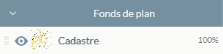
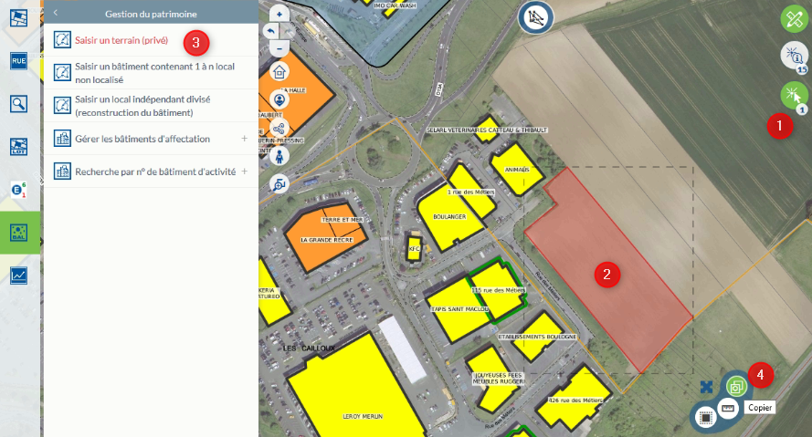

# Documentation utilisateur du module Marché immobilier dans l'application Activité Economique

## Saisir un bien immobilier de type terrain

La sasie d'un terrain peut correspondre à une parcelle cadastrale ou une partie de cette parcelle.

* **Terrain correspondant à une parcelle (récupération de la géométrie source)**

Vous pouvez afficher le fond de plan cadastrale au niveau du groupe Fonds de plan dans le Menu (cf ci-dessous).

 * 1 - Activez l'outil de sélection
 * 2 - Cliquez sur une parcelle
 * 3 - Dans le menu du Module Marché Immobilier, sélectionnez dans la partie Gestion du patrimoine, la saisie d'un terrain
 * 4 - Dans la nouvelle boite à outil qui s'affiche sur la carte, cliquez sur Copier, une fiche d'information apparaît pour la saisie des données métiers (cf ci-dessous)

 * 1 - Intégrer obligatoirement le type de terrain
 * 2 - Saisir un libellé pour le terrain décrant le type de terrain et non son occupant
 * 3 - Saisir les autres informations si nécessaire
 * 4 - Partie sur le propriété du terrain
 * 5 - Saisie manuelle de l'occupant ou de l'occupation
 * 6 - Informations pour la commercialisation
 * 7 - Informations de métadonnées pouvant être modifiées
 * 8 - L'intégration des documents joints doit se faire après l'enregistrement de la saisie (enregistrement de cette fiche puis de l'objet au point suivant). 

Particularité(s) à noter :

- le type de bien est rendu obligatoire.
- par défaut le terrain est initialisé à `Non concerné` dans la partie commercialisation.
- la saisie d'un document joint ne peut pas s'effectuer sans enregistrement préalable de la fiche. Pour lier ces informations, un clique sur l'objet sur la carte, vous permet de rouvrir la fiche, de la rendre éditable et d'y intégrer vos informations complémentaires liées. 
- il a été concidéré qu'un terrain ne pouvait être affecté à une adresse connue par défaut. L'adresse doit être saisie manuellement pour ce cas uniquement. Le même principe a été retenu pour l'occupation, une saisie libre.

**ATTENTION :** la saisie du libellé du terrain et de l'occupant sont très important pour la restitution des libellés affichés sur la carte. Pour rappel, si l'occupant est saisi, c'est lui qui affiché par défaut sur la carte. Sinon c'est le libellé du terrain [Rappel des principes des libellés](https://github.com/sigagglocompiegne/marcheimmoent/blob/master/gabarit/livrables.md).

 * 1 - Cliquez sur enregistrer

Uniquement après cette étape, vous pouvez lier vos documents, en ouvrant la fiche d'information par sélection de l'outil d'interrogation et un clic sur l'objet dans la carte, et suivre ce [tuto](https://geo.compiegnois.fr/portail/index.php/2020/06/09/comment-gerer-les-documents-lies/)

Afin de désactiver la sélection de la parcelle source à l'écran, 

 * 1 - Cliquez sur l'îcone Sélection
 * 2 - Supprimer la parcelle sélectionnée
 * 3 - La surbrillance de la sélection disparaît sur la carte affichant le résultat (cf ci-dessous)

* **Terrain correspondant à une partie de parcelle (saisie manuelle du terrain)**

Cette saisie correspond à dessiner l'emprise exacte de l'objet qui peut en partie suivre le tracé d'une parcelle.

Tous les aspects concernant la fiche d'information sont identiques au point précédent.

Vous pouvez afficher le fond de plan cadastrale au niveau du groupe Fonds de plan dans le Menu (cf ci-dessous).

 * 1 - Dans le menu du Module Marché Immobilier, sélectionnez dans la partie Gestion du patrimoine, la saisie d'un terrain
 * 2 - Activez l'outil polygone topologique et saisir votre objet [tuto](https://geo.compiegnois.fr/portail/index.php/2020/06/13/les-outils-de-dessin-avances/#dessin132)
 * 3 - Vous pouvez également configurer les options de saisies (accoche) avant la saisie ou en cours de saisie [tuto](https://geo.compiegnois.fr/portail/index.php/2020/06/13/les-outils-de-dessin-avances/#dessin12)

