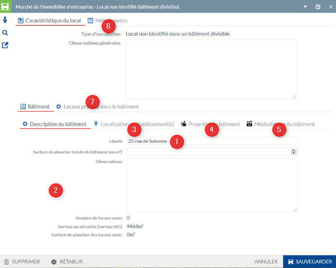
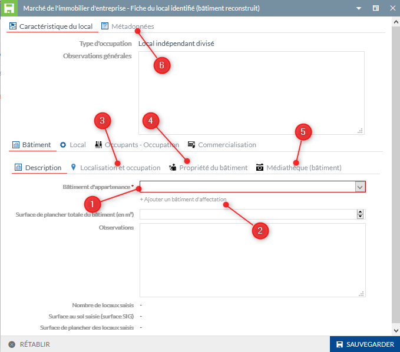

#### **Choix 3 - Saisir un bien immobilier de type terrain**

La sasie d'un terrain peut correspondre à une parcelle cadastrale ou une partie de cette parcelle.

* **Terrain correspondant à une parcelle (récupération de la géométrie source)**

Vous pouvez afficher le fond de plan cadastrale au niveau du groupe Fonds de plan dans le Menu (cf ci-dessous).

 * 1 - Activez l'outil de sélection
 * 2 - Cliquez sur une parcelle
 * 3 - Dans le menu du Module Marché Immobilier, sélectionnez dans la partie Gestion du patrimoine, la saisie d'un terrain
 * 4 - Dans la nouvelle boite à outil qui s'affiche sur la carte, cliquez sur Copier, une fiche d'information apparaît pour la saisie des données métiers (cf ci-dessous)

 * 1 - Intégrer obligatoirement le type de terrain
 * 2 - Saisir un libellé pour le terrain décrant le type de terrain et non son occupant
 * 3 - Saisir les autres informations si nécessaire
 * 4 - Partie sur le propriété du terrain
 * 5 - Saisie manuelle de l'occupant ou de l'occupation
 * 6 - Informations pour la commercialisation
 * 7 - Informations de métadonnées pouvant être modifiées
 * 8 - L'intégration des documents joints doit se faire après l'enregistrement de la saisie (enregistrement de cette fiche puis de l'objet au point suivant). 

Particularité(s) à noter :

- le type de bien est rendu obligatoire.
- par défaut le terrain est initialisé à `Non concerné` dans la partie commercialisation.
- la saisie d'un document joint ne peut pas s'effectuer sans enregistrement préalable de la fiche. Pour lier ces informations, un clique sur l'objet sur la carte, vous permet de rouvrir la fiche, de la rendre éditable et d'y intégrer vos informations complémentaires liées. 
- il a été concidéré qu'un terrain ne pouvait être affecté à une adresse connue par défaut. L'adresse doit être saisie manuellement pour ce cas uniquement. Le même principe a été retenu pour l'occupation, une saisie libre.

**ATTENTION :** la saisie du libellé du terrain et de l'occupant sont très important pour la restitution des libellés affichés sur la carte. Pour rappel, si l'occupant est saisi, c'est lui qui affiché par défaut sur la carte. Sinon c'est le libellé du terrain [Rappel des principes des libellés](https://github.com/sigagglocompiegne/marcheimmoent/blob/master/gabarit/livrables.md).

 * 1 - Cliquez sur enregistrer

Uniquement après cette étape, vous pouvez lier vos documents, en ouvrant la fiche d'information par sélection de l'outil d'interrogation et un clic sur l'objet dans la carte, et suivre ce [tuto](https://geo.compiegnois.fr/portail/index.php/2020/06/09/comment-gerer-les-documents-lies/)

Afin de désactiver la sélection de la parcelle source à l'écran, 

 * 1 - Cliquez sur l'îcone Sélection
 * 2 - Supprimer la parcelle sélectionnée
 * 3 - La surbrillance de la sélection disparaît sur la carte affichant le résultat (cf ci-dessous)

* **Terrain correspondant à une partie de parcelle (saisie manuelle du terrain)**

Cette saisie correspond à dessiner l'emprise exacte de l'objet qui peut en partie suivre le tracé d'une parcelle.

Tous les aspects concernant la fiche d'information sont identiques au point précédent.

Vous pouvez afficher le fond de plan cadastrale au niveau du groupe Fonds de plan dans le Menu (cf ci-dessous).

 * 1 - Dans le menu du Module Marché Immobilier, sélectionnez dans la partie Gestion du patrimoine, la saisie d'un terrain
 * 2 - Activez l'outil polygone topologique et saisir votre objet [tuto](https://geo.compiegnois.fr/portail/index.php/2020/06/13/les-outils-de-dessin-avances/#dessin132)
 * 3 - Vous pouvez également configurer les options de saisies (accoche) avant la saisie ou en cours de saisie [tuto](https://geo.compiegnois.fr/portail/index.php/2020/06/13/les-outils-de-dessin-avances/#dessin12)

#### **Choix 4 - Saisir un bien immobilier de type bâtiment contenant 1 ou n locaux non identifiés : Local non identifié dans un bâtiment divisible**

La saisie d'un bâtiment doit correspondre à un bâtiment du PCI Vecteur, à défaut saisir le bâtiment depuis une source extérieure (la méthode de saisie est ici la même que pour un terrain sur une partie de parcelle vu dans la partie précédente. Appliquer ces principes mais pour la saisie d'un bâtiment contenant 1 ou n locaux non identifiables).

* **Bâtiment correspondant à un bâtiment du PCI Vecteur (récupération de la géométrie source)**

Vous pouvez afficher le fond de plan cadastrale au niveau du groupe Fonds de plan dans le Menu (cf ci-dessous).

- Si un seul bâtiment en concerné :
  * 1 - Activez l'outil de sélection
  * 2 - Cliquez sur le bâtiment
  * 3 - Dans le menu du Module Marché Immobilier, sélectionnez dans la partie Gestion du patrimoine, la saisie d'un bâtiment contenant 1 ou n locaux
  * 4 - Dans la nouvelle boite à outil qui s'affiche sur la carte, cliquez sur Copier, une fiche d'information apparaît pour la saisie des données métiers (cf ci-dessous)

 
- Si le bâtiment est composé de plusieurs entités dans la source ou si vous souhaitez fusionner plusieurs bâtiments en un seul (entité multiple)
  * 2 - Cliquez sur chaque partie de bâtiment ou sur les bâtiments souhaités (clic + maintient de la touche Ctrl)
  * 4 - Dans la nouvelle boite à outil qui s'affiche sur la carte, cliquez sur Fusionner, une fiche d'information apparaît pour la saisie des données métiers (cf ci-dessous)

 * 1 - Indiquer le nom du bâtiment
 * 2 - Renseigner les informations concernant le bâtiment
 * 3 - Affecter l'adresse du bâtiment depuis la base adresse locale (récupération automatique des établissements rattachées à cette adresse)
 * 4 - Information sur la propriété
 * 5 - Onglet d'intégration des documents liés aux bâtiments
 * 6 - Informations de métadonnées pouvant être modifiées
 * 7 - Intégration des locaux (à faire après l'enregistrement de la fiche, cf partie précédente)
 
Particularité(s) à noter :

- le libellé n'est pas encore rendu obligatoire ici, mais il est préférable de saisir soit le nom du bâtiment (si il existe) ou à défaut son adresse. Cette information est répercutée au niveau de l'affichage du libellé sur la carte [Rappel des principes des libellés](https://github.com/sigagglocompiegne/marcheimmoent/blob/master/gabarit/livrables.md).
- si le type de propriétaire est indiqué en copropriété au niveau du bâtiment, la saisie du propriétaire du local sera possible dans le fiche du local.
- la saisie d'un document joint ne peut pas s'effectuer sans enregistrement préalable de la fiche. Pour lier ces informations, un clique sur l'objet sur la carte, vous permet de rouvrir la fiche, de la rendre éditable et d'y intégrer vos informations complémentaires liées.
- les établissements affectés automatiquement au bâtiment par l'adresse, ne sont pas reventilés aux locaux (fonctionnel non développé pour le moment, en réflexion si nécessaire). Un attribut est néanmoins présent pour une saisie libre d'un occupant autre ou d'une occupation particulière dans la fiche du local.

**IMPORTANT :** Avant d'affecter des locaux, dans la partie suivante, la fiche du bâtiment doit être obligatoirement enregistré.

Pour affecter des locaux, sélectionner l'outil d'interrogation, cliquer sur le bâtiment dans la carte et ouvrez la fiche d'information. Suivre les informations ci-après pour l'affectation des locaux.

1 - Cliquez sur `AJOUTER` pour insérer un nouveau local

Particularité(s) à noter :

- l'ajout d'un nouveau local joint ne peut pas s'effectuer sans enregistrement préalable de la fiche initiale. Pour lier ces informations, un clique sur l'objet sur la carte, vous permet de rouvrir la fiche, de la rendre éditable et d'y intégrer vos informations complémentaires liées. 

 * 1 - Informations génériques sur le local, des éléments descriptifs seront ajoutés par la suite. La saisie du libellé est ici importante en rapport avec la saisie de l'occupant [Rappel des principes des libellés](https://github.com/sigagglocompiegne/marcheimmoent/blob/master/gabarit/livrables.md).
 * 2 - Informations sur les surfaces
 * 3 - La médiathèque est ici réservé aux documents annexes se référant au local (photo, pdf, ...)
 * 4 - Information sur le propriétaire du local
 * 5 - Ajout d'un occupant connu ou non
 * 6 - Informations relatives à la commercialisation du local

Particularité(s) à noter :

- la saisie d'un document joint ne peut pas s'effectuer sans enregistrement préalable de la fiche. Pour lier ces informations, un clique sur l'objet sur la carte, vous permet de rouvrir la fiche, d'accéder de nouveau à la fiche du local, de la rendre éditable et d'y intégrer vos informations complémentaires liées.
- le propriétaire du local est par défaut celui du bâtiment sauf si le type de propriétaire est indiqué en copropriété, la saisie du propriétaire du local est alors possible
- par défaut le terrain est initialisé à `Non concerné` dans la partie commercialisation.

 * 1 - Tous les locaux saisis sont présent ici (1 ligne par local)
 * 2 - Accédez à la fiche du local pour visualiser toutes les informations et les mettre à jour
 * 3 - Vous pouvez ajouter un nouveau local

 * 1 - Les éléments des différents locaux affectés sont repris au niveau de l'onglet descriptif du bâtiment pour information

#### **Choix 5 - Saisir un bien immobilier de type local identifié recomponsant virtuellement le bâtiment d'activité : Local indépendant divisé**

La saisie d'un local identifié ne repose plus sur la géométrie d'un bâtiment mais sur une partie seulement.

Vous pouvez afficher le fond de plan cadastrale au niveau du groupe Fonds de plan dans le Menu (cf ci-dessous).

**SAISIE DU PREMIER LOCAL**

 * 1 - Dans le menu du Module Marché Immobilier, sélectionnez dans la partie Gestion du patrimoine, Saisir un local indépendant divisé (reconstruction du bâtiment)
 * 2 - Activez l'outil polygone topologique et saisir votre objet [tuto](https://geo.compiegnois.fr/portail/index.php/2020/06/13/les-outils-de-dessin-avances/#dessin132)
 * 3 - Vous pouvez également configurer les options de saisies (accoche) avant la saisie ou en cours de saisie [tuto](https://geo.compiegnois.fr/portail/index.php/2020/06/13/les-outils-de-dessin-avances/#dessin12)
 * 4 - A la fin de la saisie de l'objet, la fiche d'information ci-dessous s'affiche

 * 1 - Les éléments descriptifs du bâtiment sont identiques aux autres choix (des éléments descriptifs seront ajoutés par la suite), la différence ici est l'appartenance à un bâtiment existant rendu obligatoire par le choix dans une liste pré-définie. Si le bâtiment souhaité n'apparaît dans la liste ppursuivre, sinon passé l'étape 2.
 * 2 - Insérez un bâtiment non présent dans la liste

   * A - Cliquez ici pour ajouter un nouveau bâtiment
   * B - Indiquez le nom du bâtiment pour le libellé et la valeur
   * C - CLiquez sur Ajouter, le nom du bâtiment apparaît dans la liste, vous pouvez le sélectionner.
 * 3 - Affectation d'une adresse BAL au bâtiment et récupération automatique de la liste des établissements affectés à cette adresse (à faire uniquement lors de la saisie du premier local ou pour modifier l'adresse).
 * 4 - Propriété du bâtiment (à faire uniquement lors de la saisie du premier local ou pour modifier l'adresse).
 * 5 - La médiathèque est ici réservé aux documents annexes se référant au bâtiment (photo, pdf, ...)
 * 6 - Informations annexes liés à l'inventaire cartographique

**SAISIE DES LOCAUX SUPPLEMENTAIRES**

**Il est inutile de renseigner l'onglet Dexription du bâtiment en dehors de l'affectation au bâtiment présent dans la liste puisque celles-ci ont été renseignées lors de la saisie du premier local**

* 1 - 
* 2 -

Se référer à la partie précédente pour les éléments de la fiche d'information.

Particularité(s) à noter :

- l'affectation des locaux affectée à un même bâtiment permet de la reconstruire virtuellement sur la carte
- le type de bien est rendu obligatoire
- si le type de propriétaire est indiqué en copropriété au niveau du bâtiment, la saisie du propriétaire du local sera possible dans le fiche du local.
- la saisie d'un document joint ne peut pas s'effectuer sans enregistrement préalable de la fiche. Pour lier ces informations, un clique sur l'objet sur la carte, vous permet de rouvrir la fiche, de la rendre éditable et d'y intégrer vos informations complémentaires liées.
- par défaut le terrain est initialisé à `Non concerné` dans la partie commercialisation.
- les établissements affectés automatiquement au bâtiment par l'adresse, ne sont pas reventilés aux locaux (fonctionnel non développé pour le moment, en réflexion si nécessaire). Un attribut est néanmoins présent pour une saisie libre d'un occupant autre ou d'une occupation particulière dans la fiche du local.

**ATTENTION** : à l'initialisation du premier local d'un bâtiment, vous allez saisir les informations génériques du bâtiment, à la saisie d'un nouveau local affecté à ce même bâtiment, inutile de resaisir les informations du bâtiment (surface de planché ou observations). A l'enregistrement, ces informations seront automatiquement récupérées pour ce local.

#### **Choix 6 : Gérer les bâtiments d'affectation**

  * 1 - Ouvrez sur le module Marché Immobilier et dans le menu Gestion du patrimoine, cliquez sur Gérer les bâtiments d'affectation et sélectionnez le bâtiment dans la liste
  * 2 - CLiquez sur APPLIQUER
  * 3 - Le menu Résultat est activé
  * 4 - Ouvrez la fiche d'information
  * 5 - Informations modifiables sur la bâtiment d'affectation
  * 6 - Cliquez sur EDITER pour modifier les informations plus sur SAUVVEGARDER

**ATTENTION** : les éléments modifiés s'appliqueront à tous les locaux affectés au bâtiment modifié. Si vous supprimez le bâtiment, vous devrez affecter les locaux concernés à un nouveau bâtiment.

#### **Choix 7 : Recherche par n° de bâtiment d'activité**

Ce choix est uniquement visible et accessible depuis l'application par le service SIG pour une gestion interne.

