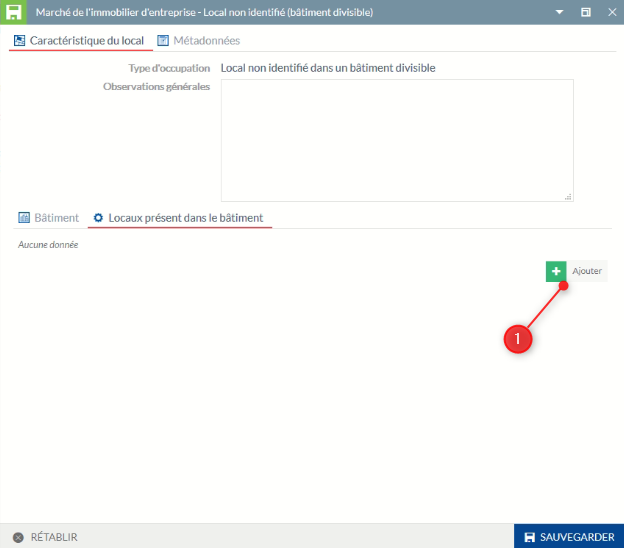
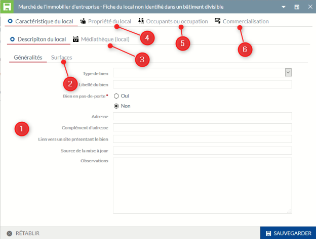
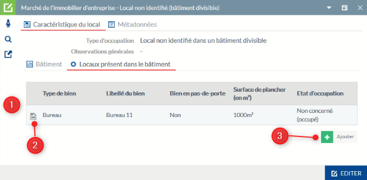
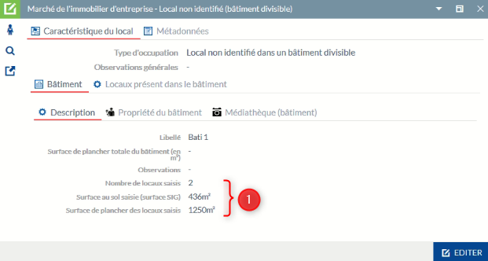

# Documentation utilisateur du module Marché immobilier dans l'application Activité Economique

## Saisir un bâtiment contenant 1 ou n locaux non identifiables

La saisie d'un bâtiment doit correspondre à un bâtiment du PCI Vecteur, à défaut saisir le bâtiment depuis une source extérieure (la méthode de saisie est ici la même que pour un terrain sur une partie de parcelle vu dans la partie précédente. Appliquer ces principes mais pour la saisie d'un bâtiment contenant 1 ou n locaux non identifiables).

* **Bâtiment correspondant à un bâtiment du PCI Vecteur (récupération de la géométrie source)**

Vous pouvez afficher le fond de plan cadastrale au niveau du groupe Fonds de plan dans le Menu (cf ci-dessous).

- Si un seul bâtiment en concerné :
  * 1 - Activez l'outil de sélection
  * 2 - Cliquez sur le bâtiment
  * 3 - Dans le menu du Module Marché Immobilier, sélectionnez dans la partie Gestion du patrimoine, la saisie d'un bâtiment contenant 1 ou n locaux
  * 4 - Dans la nouvelle boite à outil qui s'affiche sur la carte, cliquez sur Copier, une fiche d'information apparaît pour la saisie des données métiers (cf ci-dessous)

 
- Si le bâtiment est composé de plusieurs entités dans la source ou si vous souhaitez fusionner plusieurs bâtiments en un seul (entité multiple)
  * 2 - Cliquez sur chaque partie de bâtiment ou sur les bâtiments souhaités (clic + maintient de la touche Ctrl)
  * 4 - Dans la nouvelle boite à outil qui s'affiche sur la carte, cliquez sur Fusionner, une fiche d'information apparaît pour la saisie des données métiers (cf ci-dessous)

 * 1 - Indiquer le nom du bâtiment
 * 2 - Renseigner les informations concernant le bâtiment
 * 3 - Affecter l'adresse du bâtiment depuis la base adresse locale (récupération automatique des établissements rattachées à cette adresse)
 * 4 - Information sur la propriété
 * 5 - Onglet d'intégration des documents liés aux bâtiments
 * 6 - Informations de métadonnées pouvant être modifiées
 * 7 - Intégration des locaux (à faire après l'enregistrement de la fiche, cf partie précédente)
 
Particularité(s) à noter :

- le libellé n'est pas encore rendu obligatoire ici, mais il est préférable de saisir soit le nom du bâtiment (si il existe) ou à défaut son adresse. Cette information est répercutée au niveau de l'affichage du libellé sur la carte [Rappel des principes des libellés](https://github.com/sigagglocompiegne/marcheimmoent/blob/master/gabarit/livrables.md).
- si le type de propriétaire est indiqué en copropriété au niveau du bâtiment, la saisie du propriétaire du local sera possible dans le fiche du local.
- la saisie d'un document joint ne peut pas s'effectuer sans enregistrement préalable de la fiche. Pour lier ces informations, un clique sur l'objet sur la carte, vous permet de rouvrir la fiche, de la rendre éditable et d'y intégrer vos informations complémentaires liées.
- les établissements affectés automatiquement au bâtiment par l'adresse, ne sont pas reventilés aux locaux (fonctionnel non développé pour le moment, en réflexion si nécessaire). Un attribut est néanmoins présent pour une saisie libre d'un occupant autre ou d'une occupation particulière dans la fiche du local.

**IMPORTANT :** Avant d'affecter des locaux, dans la partie suivante, la fiche du bâtiment doit être obligatoirement enregistré.

Pour affecter des locaux, sélectionner l'outil d'interrogation, cliquer sur le bâtiment dans la carte et ouvrez la fiche d'information. Suivre les informations ci-après pour l'affectation des locaux.

1 - Cliquez sur `AJOUTER` pour insérer un nouveau local

Particularité(s) à noter :

- l'ajout d'un nouveau local joint ne peut pas s'effectuer sans enregistrement préalable de la fiche initiale. Pour lier ces informations, un clique sur l'objet sur la carte, vous permet de rouvrir la fiche, de la rendre éditable et d'y intégrer vos informations complémentaires liées. 

 * 1 - Informations génériques sur le local, des éléments descriptifs seront ajoutés par la suite. La saisie du libellé est ici importante en rapport avec la saisie de l'occupant [Rappel des principes des libellés](https://github.com/sigagglocompiegne/marcheimmoent/blob/master/gabarit/livrables.md).
 * 2 - Informations sur les surfaces
 * 3 - La médiathèque est ici réservé aux documents annexes se référant au local (photo, pdf, ...)
 * 4 - Information sur le propriétaire du local
 * 5 - Ajout d'un occupant connu ou non
 * 6 - Informations relatives à la commercialisation du local

Particularité(s) à noter :

- la saisie d'un document joint ne peut pas s'effectuer sans enregistrement préalable de la fiche. Pour lier ces informations, un clique sur l'objet sur la carte, vous permet de rouvrir la fiche, d'accéder de nouveau à la fiche du local, de la rendre éditable et d'y intégrer vos informations complémentaires liées.
- le propriétaire du local est par défaut celui du bâtiment sauf si le type de propriétaire est indiqué en copropriété, la saisie du propriétaire du local est alors possible
- par défaut le terrain est initialisé à `Non concerné` dans la partie commercialisation.

 * 1 - Tous les locaux saisis sont présent ici (1 ligne par local)
 * 2 - Accédez à la fiche du local pour visualiser toutes les informations et les mettre à jour
 * 3 - Vous pouvez ajouter un nouveau local

 * 1 - Les éléments des différents locaux affectés sont repris au niveau de l'onglet descriptif du bâtiment pour information

**ATTENTION** : les éléments modifiés s'appliqueront à tous les locaux affectés au bâtiment modifié. Si vous supprimez le bâtiment, vous devrez affecter les locaux concernés à un nouveau bâtiment.

#### **Choix 7 : Recherche par n° de bâtiment d'activité**

Ce choix est uniquement visible et accessible depuis l'application par le service SIG pour une gestion interne.

