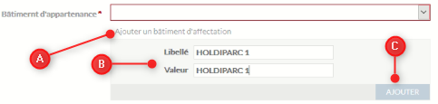

# Documentation utilisateur du module Marché immobilier dans l'application Activité Economique

## Saisir des locaux identifiables reconstruisant le bâtiment

La saisie d'un local identifié ne repose plus sur la géométrie d'un bâtiment mais sur une partie seulement.

Vous pouvez afficher le fond de plan cadastrale au niveau du groupe Fonds de plan dans le Menu (cf ci-dessous).

**SAISIE DU PREMIER LOCAL**

 * 1 - Dans le menu du Module Marché Immobilier, sélectionnez dans la partie Gestion du patrimoine, Saisir un local indépendant divisé (reconstruction du bâtiment)
 * 2 - Activez l'outil polygone topologique et saisir votre objet [tuto](https://geo.compiegnois.fr/portail/index.php/2020/06/13/les-outils-de-dessin-avances/#dessin132)
 * 3 - Vous pouvez également configurer les options de saisies (accoche) avant la saisie ou en cours de saisie [tuto](https://geo.compiegnois.fr/portail/index.php/2020/06/13/les-outils-de-dessin-avances/#dessin12)
 * 4 - A la fin de la saisie de l'objet, la fiche d'information ci-dessous s'affiche

 * 1 - Les éléments descriptifs du bâtiment sont identiques aux autres choix (des éléments descriptifs seront ajoutés par la suite), la différence ici est l'appartenance à un bâtiment existant rendu obligatoire par le choix dans une liste pré-définie. Si le bâtiment souhaité n'apparaît dans la liste ppursuivre, sinon passé l'étape 2.
 * 2 - Insérez un bâtiment non présent dans la liste

   * A - Cliquez ici pour ajouter un nouveau bâtiment
   * B - Indiquez le nom du bâtiment pour le libellé et la valeur
   * C - CLiquez sur Ajouter, le nom du bâtiment apparaît dans la liste, vous pouvez le sélectionner.
 * 3 - Affectation d'une adresse BAL au bâtiment et récupération automatique de la liste des établissements affectés à cette adresse (à faire uniquement lors de la saisie du premier local ou pour modifier l'adresse).
 * 4 - Propriété du bâtiment (à faire uniquement lors de la saisie du premier local ou pour modifier l'adresse).
 * 5 - La médiathèque est ici réservé aux documents annexes se référant au bâtiment (photo, pdf, ...)
 * 6 - Informations annexes liés à l'inventaire cartographique

**SAISIE DES LOCAUX SUPPLEMENTAIRES**

**Il est inutile de renseigner l'onglet Dexription du bâtiment en dehors de l'affectation au bâtiment présent dans la liste puisque celles-ci ont été renseignées lors de la saisie du premier local**

* 1 - 
* 2 -

Se référer à la partie précédente pour les éléments de la fiche d'information.

Particularité(s) à noter :

- l'affectation des locaux affectée à un même bâtiment permet de la reconstruire virtuellement sur la carte
- le type de bien est rendu obligatoire
- si le type de propriétaire est indiqué en copropriété au niveau du bâtiment, la saisie du propriétaire du local sera possible dans le fiche du local.
- la saisie d'un document joint ne peut pas s'effectuer sans enregistrement préalable de la fiche. Pour lier ces informations, un clique sur l'objet sur la carte, vous permet de rouvrir la fiche, de la rendre éditable et d'y intégrer vos informations complémentaires liées.
- par défaut le terrain est initialisé à `Non concerné` dans la partie commercialisation.
- les établissements affectés automatiquement au bâtiment par l'adresse, ne sont pas reventilés aux locaux (fonctionnel non développé pour le moment, en réflexion si nécessaire). Un attribut est néanmoins présent pour une saisie libre d'un occupant autre ou d'une occupation particulière dans la fiche du local.

**ATTENTION** : à l'initialisation du premier local d'un bâtiment, vous allez saisir les informations génériques du bâtiment, à la saisie d'un nouveau local affecté à ce même bâtiment, inutile de resaisir les informations du bâtiment (surface de planché ou observations). A l'enregistrement, ces informations seront automatiquement récupérées pour ce local.

