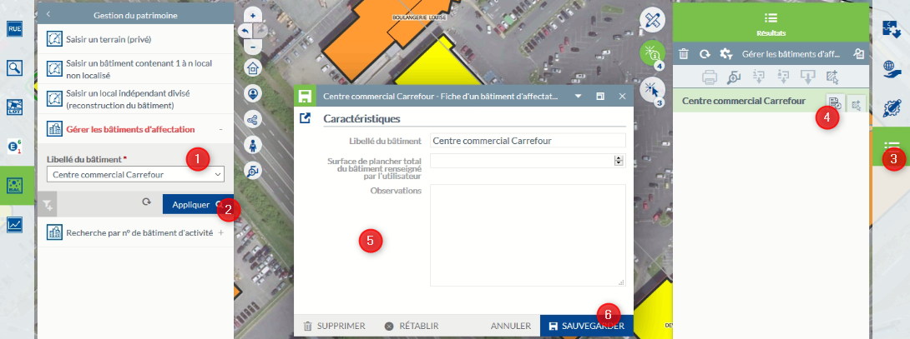

# Documentation utilisateur du module Marché immobilier dans l'application Activité Economique

## Gérer les bâtiments d'affectation

  * 1 - Ouvrez sur le module Marché Immobilier et dans le menu Gestion du patrimoine, cliquez sur Gérer les bâtiments d'affectation et sélectionnez le bâtiment dans la liste
  * 2 - CLiquez sur APPLIQUER
  * 3 - Le menu Résultat est activé
  * 4 - Ouvrez la fiche d'information
  * 5 - Informations modifiables sur la bâtiment d'affectation
  * 6 - Cliquez sur EDITER pour modifier les informations plus sur SAUVVEGARDER

**ATTENTION** : les éléments modifiés s'appliqueront à tous les locaux affectés au bâtiment modifié. Si vous supprimez le bâtiment, vous devrez affecter les locaux concernés à un nouveau bâtiment.

