# Documentation utilisateur du module Marché Immobilier intégré à l'application Activité Economique #

## Pour tous les utilisateurs :

### Accès aux informations d'un bâtiment ou d'un local d'activités

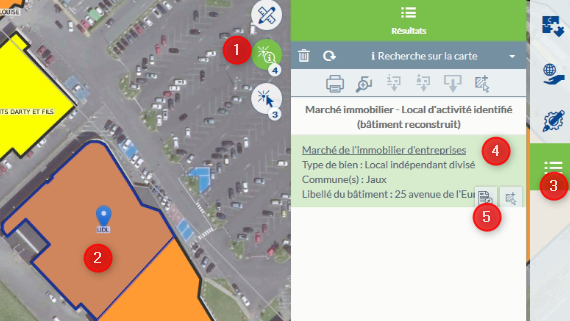

  * 1 - Activez l'outil de sélection
  * 2 - Cliquez sur le bâtiment ou le local d'activité
  * 3 - Le menu résultat apparaît, listant l'ensemble des résultats du clic
  * 4 - La partie Marché immobilier vous indique le résultat du clic
  * 5 - Cliquez sur l'icône de la fiche pour ouvrir la fiche d'informations des données du bâtiment et du ou des locaux d'activité

Plus de détails sur le fonctionnement du menu Résultat dans ce [tuto](https://geo.compiegnois.fr/portail/index.php/2020/06/20/les-outils-de-recherche/)

### Recherche d'un bien disponible à la vente et/ou à la location

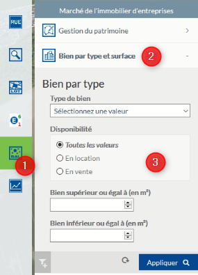

  * 1 - Ouvrez sur le module Marché Immobilier
  * 2 - Ouvrez la recherche par type de bien et de surface
  * 3 - Vous pouvez affiner votre recherche en indiquant des critères. Cliquez sur APPLIQUER pour lancer la recherche et activer le menu Résultat pour visualiser le résultat de cette recherche.

Plus de détails sur le fonctionnement du menu Résultat dans ce [tuto](https://geo.compiegnois.fr/portail/index.php/2020/06/20/les-outils-de-recherche/)

## Pour les administrateurs : 

Cette documentation est spécifique aux personnes intégrant de la donnée depuis l'application Web.

### La modification de l'inventaire

Si le bien est déjà saisi, l'accès à ces informations pour compléments ou ajouts d'informations (média, occupants, locaux éventuels pour les bâtiments concernés) est possible par simple clic sur l'objet à partir de la carte. Ce fonctionnel permet d'accéder de nouveau à la fiche d'informations pour la modifier.

### La suppression de l'inventaire

Pour supprimer un objet saisi, un simple clic sur l'objet à partir de la carte vous ouvre la fiche d'informations. Rendez la fiche d'informations éditable en cliquant sur EDITER, puis cliquez sur SUPPRIMER. Le développement fonctionnel supprime automatiquement les objets et les informations liées de cette manière :
- pour un terrain : suppression classique de l'objet et des informations liées dans la base
- pour un local (Bâtiment non divisé) : suppression de l'objet et des informatiosn liées dans la base, y compris les information du bâtiment
- pour un local indépendant divisé : la suppression de tous les objets (ou locaux) appartenant à un même bâtiment supprime par défaut toutes les informations, y compris celles du bâtiment d'appartenance. Si il reste 1 local d'appartenance, les informations du bâtiment demeurent et le bâtiment est reconstruit virtuellement avec les locaux restant.
- pour un local non identifié dans un bâtiment divisible : chaque local attaché à un bâtiment peut-être suppprimé indivuellement. La suppression de tous les locaux n'entraine pas ici la suppression des informations du bâtiment. Pour supprimer définitivement ces informations, il faut EDITER la fiche et cliquer sur SUPPRIMER.

### La saisie dans l'inventaire

La saisie des objets doit respecter les principes et les règles de modélisation édictées [ici](https://github.com/sigagglocompiegne/marcheimmoent/blob/master/gabarit/livrables.md).

La documentation ci-après s'attachera à indiquer les outils fonctionnels de l'application Web à utiliser pour la saisie et la gestion des données.

#### Généralités

Le développement fonctionnel de l'inventaire cartographique priviligie l'accès par type de biens. Vous trouverez ci-dessous les différents choix possibles. 

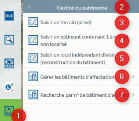

 * 1 - Accès aux fonctionnalités avancées du module Marché Immobilier
 * 2 - Accès aux fonctionnalités de gestion
 * 3 - Accès à la saisie d'un terrain
 * 4 - Accès à la saisie d'un bâtiment contenant 1 ou n locaux non identifiables
 * 5 - Accès à la saisie de locaux identifiables reconstruisant la bâtiment
 * 6 - Accès à la gestion des bâtiments d'affectation
 * 7 - Accès à la Recherche par n° de bâtiment d'activité (ce choix est uniquement visible et accessible depuis l'application par le service SIG pour une gestion interne)

Seules les informations nécessaires à la saisie des objets du marché immobilier sont décrites ci-après, pour plus détails sur les options liées aux dessins (saisie, accroche, ...) vous pouvez consulter le tutoriel [Dessiner et Annoter](https://geo.compiegnois.fr/portail/index.php/2020/06/16/les-outils-de-dessin/) et le tutoriel [Dessiner en mode avancé](https://geo.compiegnois.fr/portail/index.php/2020/06/13/les-outils-de-dessin-avances/)

#### Choix 3 - Saisir un bien immobilier de type terrain

La sasie d'un terrain peut correspondre à une parcelle cadastrale ou une partie de cette parcelle.

**Terrain correspondant à une parcelle (récupération de la géométrie source)**

Vous pouvez afficher le fond de plan cadastrale au niveau du groupe Fonds de plan dans le Menu (cf ce-dessous).

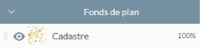

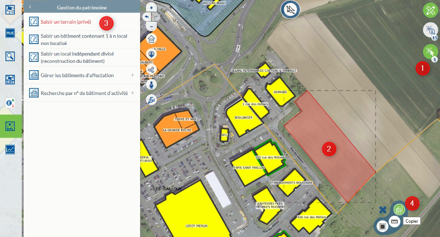

 * 1 - Accès aux fonctionnalités avancées du module Marché Immobilier
 * 2 - Accès aux fonctionnalités de gestion

**Terrain correspondant à une partie de parcelle (saisie manuelle du terrain)**

Particularité(s) à noter :

- le type de bien est rendu obligatoire.
- par défaut le terrain est initialisé à `Non concerné` dans la partie commercialisation.
- la saisie d'un document joint ne peut pas s'effectuer sans enregistrement préalable de la fiche. Pour lier ces informations, un clique sur l'objet sur la carte, vous permet de rouvrir la fiche, de la rendre éditable et d'y intégrer vos informations complémentaires liées. 
- il a été concidéré qu'un terrain ne pouvait être affecté à une adresse connue par défaut. L'adresse doit être saisie manuellement pour ce cas uniquement. Le même principe a été retenu pour l'occupation, une saisie libre.

#### Choix 4 - Saisir un bien immobilier de type bâtiment contenant 1 ou n locaux non identifiés : Local non identifié dans un bâtiment divisible 

Vous pouvez afficher le fond de plan cadastrale au niveau du groupe Fonds de plan dans le Menu (cf ce-dessous).

Particularité(s) à noter :

- le libellé n'est pas encore rendu obligatoire ici, mais il est préférable de saisir un nom de bâtiment (même si celui-ci se nomme comme l'occupant), pour qu'il s'affiche sur la partie cartographique.
- si le type de propriétaire est indiqué en copropriété au niveau du bâtiment, la saisie du propriétaire du local sera possible dans le fiche du local.
- la saisie d'un document joint ne peut pas s'effectuer sans enregistrement préalable de la fiche. Pour lier ces informations, un clique sur l'objet sur la carte, vous permet de rouvrir la fiche, de la rendre éditable et d'y intégrer vos informations complémentaires liées.
- les établissements affectés automatiquement au bâtiment par l'adresse, ne sont pas reventilés aux locaux (fonctionnel non développé pour le moment, en réflexion si nécessaire). Un attribut est néanmoins présent pour une saisie libre d'un occupant autre ou d'une occupation particulière dans la fiche du local.

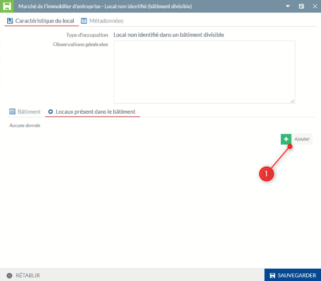

1 - Cliquez sur `AJOUTER` pour insérer un nouveau local

Particularité(s) à noter :

- l'ajout d'un nouveau local joint ne peut pas s'effectuer sans enregistrement préalable de la fiche initiale. Pour lier ces informations, un clique sur l'objet sur la carte, vous permet de rouvrir la fiche, de la rendre éditable et d'y intégrer vos informations complémentaires liées. 

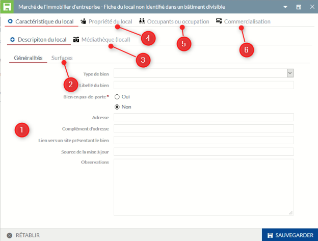

1 - Informations génériques sur le local, des éléments descriptifs seront ajoutés par la suite

2 - Informations sur les surfaces

3 - La médiathèque est ici réservé aux documents annexes se référant au local (photo, pdf, ...)

4 - Information sur le propriétaire du local

5 - Ajout d'un occupant connu ou non

6 - Informations relatives à la commercialisation du local

Particularité(s) à noter :

- la saisie d'un document joint ne peut pas s'effectuer sans enregistrement préalable de la fiche. Pour lier ces informations, un clique sur l'objet sur la carte, vous permet de rouvrir la fiche, d'accéder de nouveau à la fiche du local, de la rendre éditable et d'y intégrer vos informations complémentaires liées.
- le propriétaire du local est par défaut celui du bâtiment sauf si le type de propriétaire est indiqué en copropriété, la saisie du propriétaire du local est alors possible
- par défaut le terrain est initialisé à `Non concerné` dans la partie commercialisation.

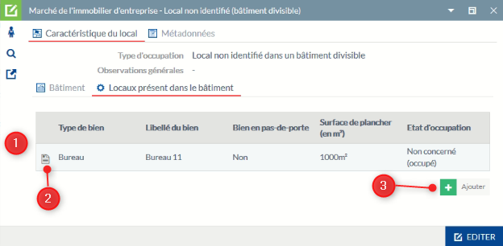

1 - Tous les locaux saisis sont présent ici (1 ligne par local)

2 - Accédez à la fiche du local pour visualiser toutes les informations et les mettre à jour

3 - Vous pouvez ajouter un nouveau local

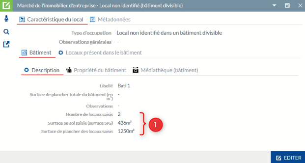

1 - Les éléments des différents locaux affectés sont repris au niveau de l'onglet descriptif du bâtiment pour information

#### Choix 5 - Saisir un bien immobilier de type local identifié recomponsant virtuellement le bâtiment d'activité : Local indépendant divisé

Après la saisie du bien, une fiche d'informations apparaît pour la saisie des données métiers. En cliquant sur SAUVEGARDER en bas de la fiche, l'objet est enregistré dans la base de données sur marché de l'immobilier d'entreprises.

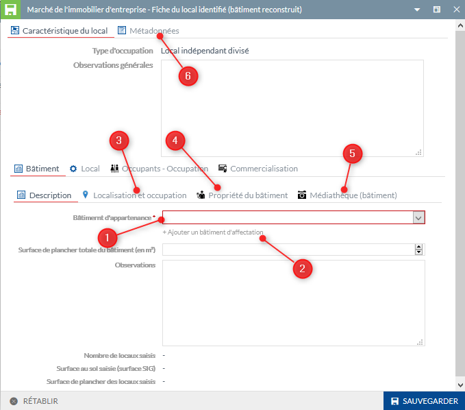

1 - Les éléments descriptifs du bâtiment sont identiques aux autres choix (des éléments descriptifs seront ajoutés par la suite), la différence ici est l'appartenance à un bâtiment existant rendu obligatoire par le choix dans une liste pré-définie. Si le bâtiment souhaité n'apparaît dans la liste ppursuivre, sinon passé l'étape 2.

2 - Insérez un bâtiment non présent dans la liste
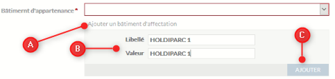

A - Cliquez ici pour ajouter un nouveau bâtiment

B - Indiquez le nom du bâtiment pour le libellé et la valeur

C - CLiquez sur Ajouter, le nom du bâtiment apparaît dans la liste, vous pouvez le sélectionner.

3 - Affectation d'une adresse BAL au bâtiment et récupération automatique de la liste des établissements affectés à cette adresse (à faire uniquement lors de la saisie du premier local ou pour modifier l'adresse).

4 - Propriété du bâtiment (à faire uniquement lors de la saisie du premier local ou pour modifier l'adresse).

5 - La médiathèque est ici réservé aux documents annexes se référant au bâtiment (photo, pdf, ...)

6 - Informations annexes liés à l'inventaire cartographique

Particularité(s) à noter :

- l'affectation des locaux affectée à un même bâtiment permet de la reconstruire virtuellement sur la carte
- le type de bien est rendu obligatoire
- si le type de propriétaire est indiqué en copropriété au niveau du bâtiment, la saisie du propriétaire du local sera possible dans le fiche du local.
- la saisie d'un document joint ne peut pas s'effectuer sans enregistrement préalable de la fiche. Pour lier ces informations, un clique sur l'objet sur la carte, vous permet de rouvrir la fiche, de la rendre éditable et d'y intégrer vos informations complémentaires liées.
- par défaut le terrain est initialisé à `Non concerné` dans la partie commercialisation.
- les établissements affectés automatiquement au bâtiment par l'adresse, ne sont pas reventilés aux locaux (fonctionnel non développé pour le moment, en réflexion si nécessaire). Un attribut est néanmoins présent pour une saisie libre d'un occupant autre ou d'une occupation particulière dans la fiche du local.

**ATTENTION** : à l'initialisation du premier local d'un bâtiment, vous allez saisir les informations génériques du bâtiment, à la saisie d'un nouveau local affecté à ce même bâtiment, inutile de resaisir les informations du bâtiment (surface de planché ou observations). A l'enregistrement, ces informations seront automatiquement récupérées pour ce local.

#### Choix 6 : Gérer les bâtiments d'affectation

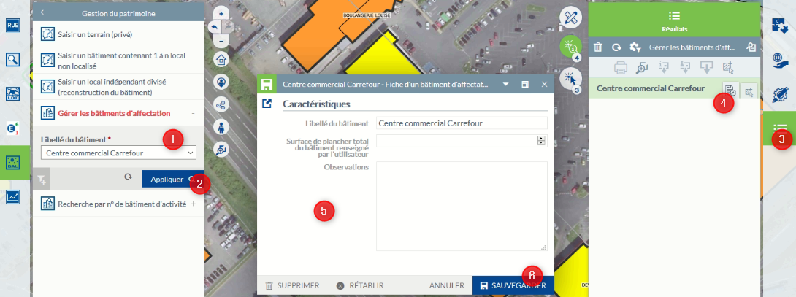

  * 1 - Ouvrez sur le module Marché Immobilier et dans le menu Gestion du patrimoine, cliquez sur Gérer les bâtiments d'affectation et sélectionnez le bâtiment dans la liste
  * 2 - CLiquez sur APPLIQUER
  * 3 - Le menu Résultat est activé
  * 4 - Ouvrez la fiche d'information
  * 5 - Informations modifiables sur la bâtiment d'affectation
  * 6 - Cliquez sur EDITER pour modifier les informations plus sur SAUVVEGARDER

**ATTENTION** : les éléments modifiés s'appliqueront à tous les locaux affectés au bâtiment modifié. Si vous supprimez le bâtiment, vous devrez affecter les locaux concernés à un nouveau bâtiment.

#### Choix 7 : Recherche par n° de bâtiment d'activité

Ce choix est uniquement visible et accessible depuis l'application par le service SIG pour une gestion interne.

