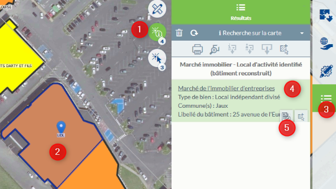

# Documentation utilisateur du module Marché immobilier dans l'application Activité Economique

## Accès aux informations d'un terrain, d'un bâtiment ou d'un local d'activités

  * 1 - Activer l'outil d'interrogation
  * 2 - Cliquer sur un objet dans la carte 
  * 3 - Le menu Résultat s'ouvre pour visualiser les résultats au clic (d'autres résultats peuvent remonter comme l'accès à la fiche parcelle et fiche de renseignements d'urbanisme, ...)
  * 4 - Vous trouverez dans la partie Marché Immobilier, les résultats de la sélection
  * 5 - Cliquer sur l'icône de la fiche pour l'ouvrir

Vous pouvez également consulter le [tuto](https://geo.compiegnois.fr/portail/index.php/2020/06/20/les-outils-de-recherche/) sur le menu Résultat pour plus d'informations sur son fonctionnement.
