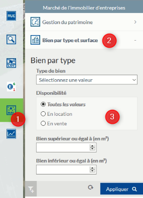

# Documentation utilisateur du module Marché immobilier dans l'application Activité Economique

## Recherche d'un bien disponible à la vente et/ou à la location

  * 1 - Ouvrir le menu du module Marché Immobilier
  * 2 - Cliquer sur la recherche d'un bien par type et/ou surface
  * 3 - Définisser les critères de votre recherche et cliquer sur Appliquer
  
  Le résultat de votre recherche s'affichera dans le menu du même nom et vous aurez accès à la fiche du bien en cliquant sur l'icône de la fiche.
