# Documentation utilisateur de l'application #

## Pour tous les utilisateurs :
- (non opérationnel)

## Pour les administrateurs : 

Cette documentation est spécifique aux personnes intégrant de la donnée, soit par l'intermédiaire de l'inventaire cartographique possible depuis l'application Web ou depuis le gabarit QGIS disponible [ici](https://github.com/sigagglocompiegne/marcheimmoent/blob/master/gabarit/livrables.md). Les compléments métiers des biens du marché de l'immobilier d'entreprises sont assurés par le service métier concerné.

**La modification de l'inventaire**

Si le bien est déjà saisi, l'accès à ces informations pour compléments ou ajouts d'informations (média, occupants, locaux éventuels pour les bâtiments concernés) est possible par simple clic sur l'objet à partir de la carte. Ce fonctionnel permet d'accéder de nouveau à la fiche d'informations pour la modifier.

**La suppression de l'inventaire**

Pour supprimer un objet saisi, un simple clic sur l'objet à partir de la carte vous ouvre la fiche d'informations. Rendez la fiche d'informations éditable en cliquant sur EDITER, puis cliquez sur SUPPRIMER. Le développement fonctionnel supprime automatiquement les objets et les informations liées de cette manière :
- pour un terrain : suppression classique de l'objet et des informations liées dans la base
- pour un local (Bâtiment non divisé) : suppression de l'objet et des informatiosn liées dans la base, y compris les information du bâtiment
- pour un local indépendant divisé : la suppression de tous les objets (ou locaux) appartenant à un même bâtiment supprime par défaut toutes les informations, y compris celles du bâtiment d'appartenance. Si il reste 1 local d'appartenance, les informations du bâtiment demeurent et le bâtiment est reconstruit virtuellement avec les locaux restant.
- pour un local non identifié dans un bâtiment divisible : chaque local attaché à un bâtiment peut-être suppprimé indivuellement. La suppression de tous les locaux n'entraine pas ici la suppression des informations du bâtiment. Pour supprimer définitivement ces informations, il faut EDITER la fiche et cliquer sur SUPPRIMER.

**La saisie de l'inventaire**

Le développement fonctionnel de l'inventaire cartographique priviligie l'accès par type de biens. Vous trouverez ci-dessous les différents choix possibles. 

1 - Cliquez sur le module métier pour accéder aux diverses fonctoins de gestion de l'inventaire

2 - Cliquez sur le sous-menu `Gestion de votre patrimoine` et choissisez le type d'objets à saisir

3 - Cliquez sur l'outil de dessin (ici polygon topologique)

Les options liées aux dessins (saisie, accroche, ...) sont détaillées au niveau du tutoriel [Dessiner et Annoter](https://geo.compiegnois.fr/portail/index.php/2020/06/16/les-outils-de-dessin/) et du tutoriel [Dessiner en mode avancé](https://geo.compiegnois.fr/portail/index.php/2020/06/13/les-outils-de-dessin-avances/)

### Choix 1 - Saisir un bien immobilier de type terrain

Après la saisie du bien, une fiche d'informations apparaît pour la saisie des données métiers. En cliquant sur SAUVEGARDER en bas de la fiche, l'objet est enregistré dans la base de données sur marché de l'immobilier d'entreprises.

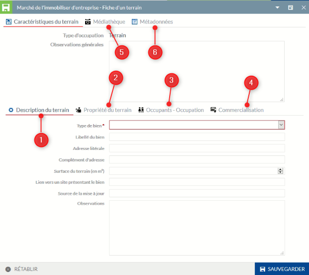

1 - Elément de généralité du bien, des éléments descriptifs seront ajoutés par la suite

2 - Informations sur le propriétaire du bien

3 - Affectation des occupants ou de l'occupation connue
 
4 - Element concernant la commercialisation

5 - La médiathèque permet de lier des documents annexes au bien (photo, pdf, ...)

6 - Informations annexes liés à l'inventaire cartographique

Particularité(s) à noter :

- le type de bien est rendu obligatoire.
- par défaut le terrain est initialisé à `Non concerné` dans la partie commercialisation.
- la saisie d'un document joint ou de l'affectation d'un occupant ne peut pas s'effectuer sans enregistrement préalable de la fiche. Pour lier ces informations, un clique sur l'objet sur la carte, vous permet de rouvrir la fiche, de la rendre éditable et d'y intégrer vos informations complémentaires liées.  
- l'affectation d'adresse sur la Base Locale des Adresses n'est pas opérationnelle à ce stade.

### Choix 2 - Saisir un bien immobilier de type local correspondant à un bâtiment : Local (Bâtiment non divisé)

Après la saisie du bien, une fiche d'informations apparaît pour la saisie des données métiers. En cliquant sur SAUVEGARDER en bas de la fiche, l'objet est enregistré dans la base de données sur marché de l'immobilier d'entreprises.

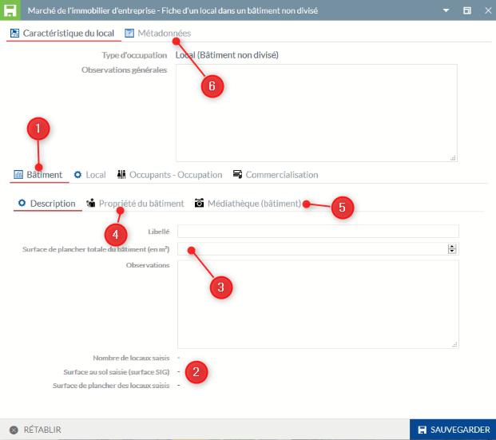

1 - Onglet permettant la saisie des informations liées aux bâtiments

2 - Informations calculées automatiquement par rapport au local saisie dans l'onglet `Local`

3 - Surface de planché totale du bâtiment

4 - Propriété du bâtiment

5 - La médiathèque est ici réservé aux documents annexes se référant au bâtiment (photo, pdf, ...)

6 - Informations annexes liés à l'inventaire cartographique

Particularité(s) à noter :

- le libellé n'est pas encore rendu obligatoire ici, mais il est préférable de saisir un nom de bâtiment (même si celui-ci se nomme comme l'occupant), pour qu'il s'affiche sur la partie cartographique.
- par défaut le propriétaire du bâtiment est celui du local.
- par défaut le local est initialisé à `Non concerné` dans la partie commercialisation.
- l'affectation d'adresse sur la Base Locale des Adresses n'est pas opérationnelle à ce stade.
- la saisie d'un document joint ou de l'affectation d'un occupant ne peut pas s'effectuer sans enregistrement préalable de la fiche. Pour lier ces informations, un clique sur l'objet sur la carte, vous permet de rouvrir la fiche, de la rendre éditable et d'y intégrer vos informations complémentaires liées.  

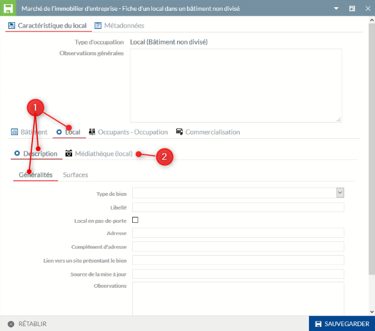

1 - Elément de généralité du local, des éléments descriptifs seront ajoutés par la suite

2 - La médiathèque est ici réservé aux documents annexes se référant au local (photo, pdf, ...)

Particularité(s) à noter :

- la saisie d'un document joint ou de l'affectation d'un occupant ne peut pas s'effectuer sans enregistrement préalable de la fiche. Pour lier ces informations, un clique sur l'objet sur la carte, vous permet de rouvrir la fiche, de la rendre éditable et d'y intégrer vos informations complémentaires liées.  

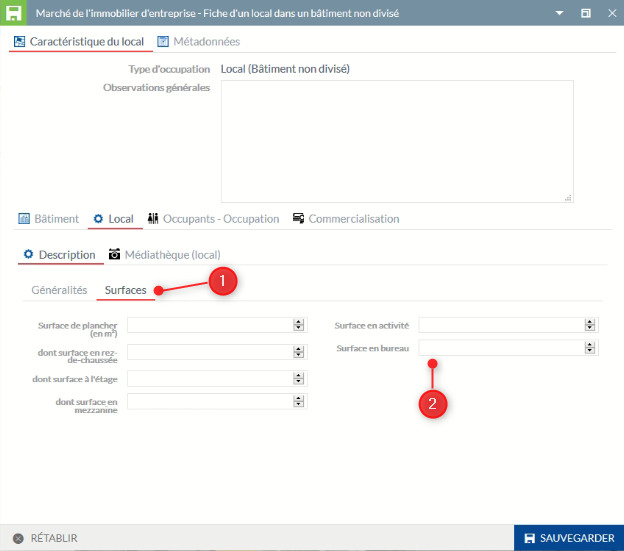

1 - Informations sur les différentes surfaces à renseigner

2 - Ces 2 dernières surfaces ne sont disponibles que si le local est déclaré en activité dans le type de bien.

Particularité(s) à noter :

- possibilité d'affecter un établissement SIRENE par une recherche par son numéro SIRET, son nom, son enseigne, ... dans l'onglet `Occupant(s) ou occupation`

### Choix 3 - Saisir un bien immobilier de type bâtiment contenant n locaux non identifiés : Local non identifié dans un bâtiment divisible

Après la saisie du bien, une fiche d'informations apparaît pour la saisie des données métiers. En cliquant sur SAUVEGARDER en bas de la fiche, l'objet est enregistré dans la base de données sur marché de l'immobilier d'entreprises.

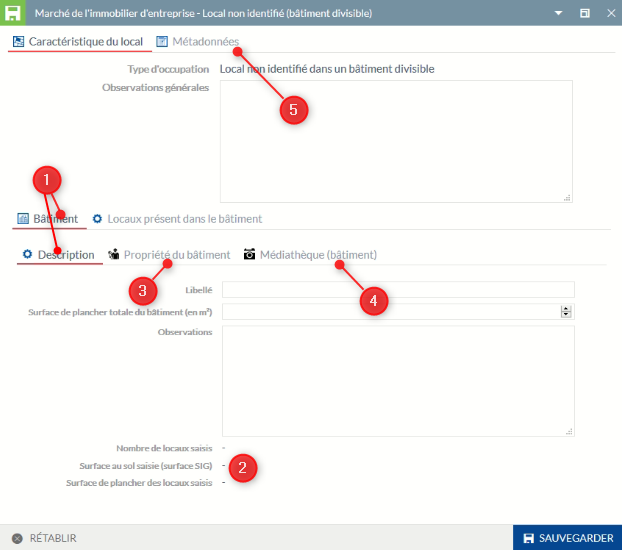

1 - Onglet permettant la saisie des informations liées aux bâtiments dont la surface de planché totale du bâtiment

2 - Informations calculées automatiquement par rapport au local saisie dans l'onglet `Local`

3 - Propriété du bâtiment

4 - La médiathèque est ici réservé aux documents annexes se référant au bâtiment (photo, pdf, ...)

5 - Informations annexes liés à l'inventaire cartographique

Particularité(s) à noter :

- le libellé n'est pas encore rendu obligatoire ici, mais il est préférable de saisir un nom de bâtiment (même si celui-ci se nomme comme l'occupant), pour qu'il s'affiche sur la partie cartographique.
- si le type de propriétaire est indiqué en copropriété au niveau du bâtiment, la saisie du propriétaire du local sera possible dans le fiche du local.
- l'affectation d'adresse sur la Base Locale des Adresses n'est pas opérationnelle à ce stade.
- la saisie d'un document joint ne peut pas s'effectuer sans enregistrement préalable de la fiche. Pour lier ces informations, un clique sur l'objet sur la carte, vous permet de rouvrir la fiche, de la rendre éditable et d'y intégrer vos informations complémentaires liées.

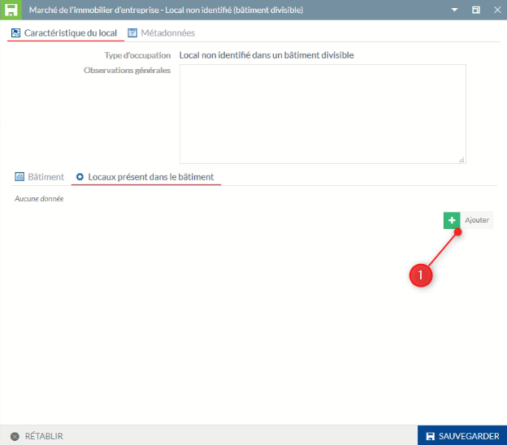

1 - Cliquez sur `AJOUTER` pour insérer un nouveau local

Particularité(s) à noter :

- l'ajout d'un nouveau local joint ne peut pas s'effectuer sans enregistrement préalable de la fiche initiale. Pour lier ces informations, un clique sur l'objet sur la carte, vous permet de rouvrir la fiche, de la rendre éditable et d'y intégrer vos informations complémentaires liées. 

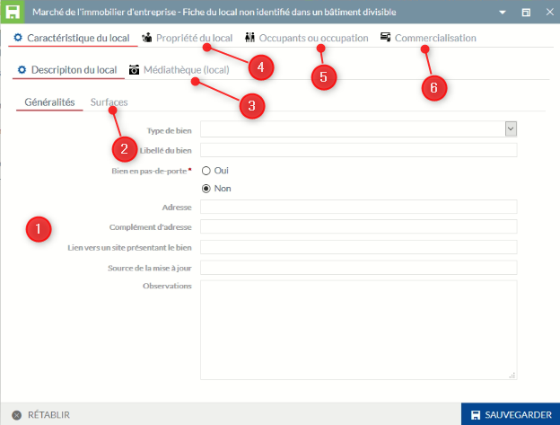

1 - Informations génériques sur le local, des éléments descriptifs seront ajoutés par la suite

2 - Informations sur les surfaces (même principe que le choix 2)

3 - La médiathèque est ici réservé aux documents annexes se référant au local (photo, pdf, ...)

4 - Information sur le propriétaire du local

5 - Ajout d'un occupant connu ou non. Possibilité d'affecter un établissement SIRENE par une recherche par son numéro SIRET, son nom, son enseigne, ...

6 - Informations relatives à la commercialisation du local

Particularité(s) à noter :

- la saisie d'un document joint ne peut pas s'effectuer sans enregistrement préalable de la fiche. Pour lier ces informations, un clique sur l'objet sur la carte, vous permet de rouvrir la fiche, d'accéder de nouveau à la fiche du local, de la rendre éditable et d'y intégrer vos informations complémentaires liées.
- le propriétaire du local est par défaut celui du bâtiment sauf si le type de propriétaire est indiqué en copropriété, la saisie du propriétaire du local est alors possible
- par défaut le terrain est initialisé à `Non concerné` dans la partie commercialisation.

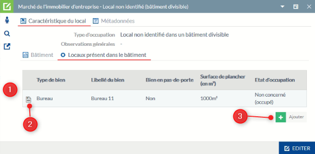

1 - Tous les locaux saisis sont présent ici (1 ligne par local)

2 - Accédez à la fiche du local pour visualiser toutes les informations et les mettre à jour

3 - Vous pouvez ajouter un nouveau local

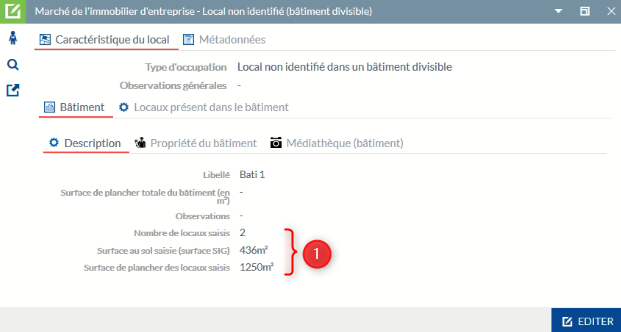

1 - Les éléments des différents locaux affectés sont repris au niveau de l'onglet descriptif du bâtiment pour information

#### Résultat cartographique pour le choix 3

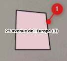

1 - Représentation du bâtiment seul avec en étiquette le nom du bâtiment et entre parenthèse le nombre de locaux affectés non identifiés (ici 3)

### Choix 4 - Saisir un bien immobilier de type local identifié recomponsant virtuellement le bâtiment d'activité : Local indépendant divisé

Après la saisie du bien, une fiche d'informations apparaît pour la saisie des données métiers. En cliquant sur SAUVEGARDER en bas de la fiche, l'objet est enregistré dans la base de données sur marché de l'immobilier d'entreprises.

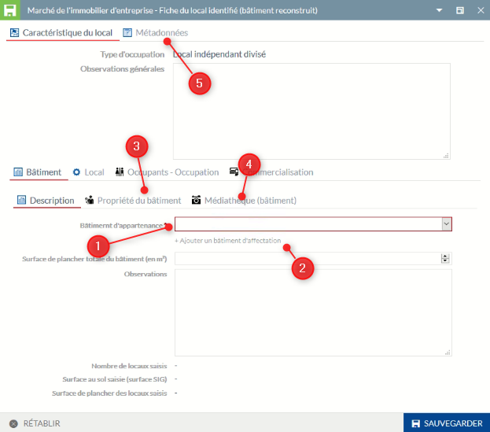

1 - Les éléments descriptifs du bâtiment sont identiques aux autres choix (des éléments descriptifs seront ajoutés par la suite), la différence ici est l'appartenance à un bâtiment existant rendu obligatoire par le choix dans une liste pré-définie.

2 - Insérez un bâtiment non présent dans la liste
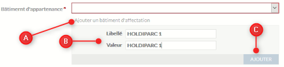

A - Cliquez ici pour ajouter un nouveau bâtiment

B - Indiquez le nom du bâtiment pour le libellé et la valeur

C - CLiquez sur Ajouter, le nom du bâtiment apparaît dans la liste, vous pouvez le sélectionner.

3 - Propriété du bâtiment

4 - La médiathèque est ici réservé aux documents annexes se référant au bâtiment (photo, pdf, ...)

5 - Informations annexes liés à l'inventaire cartographique

Particularité(s) à noter :

- l'affectation des locaux affectée à un même bâtiment permet de la reconstruire virtuellement sur la carte
- si le type de propriétaire est indiqué en copropriété au niveau du bâtiment, la saisie du propriétaire du local sera possible dans le fiche du local.
- l'affectation d'adresse sur la Base Locale des Adresses n'est pas opérationnelle à ce stade.
- la saisie d'un document joint ne peut pas s'effectuer sans enregistrement préalable de la fiche. Pour lier ces informations, un clique sur l'objet sur la carte, vous permet de rouvrir la fiche, de la rendre éditable et d'y intégrer vos informations complémentaires liées.

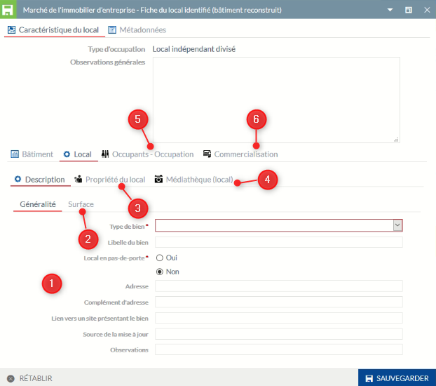

1 - Eléments généraux sur le bâtiment

2 - Informations sur les surfaces (même principe que le choix 2)

3 - Propriétaire du local (si différents du bâtiment)

4 - La médiathèque est ici réservé aux documents annexes se référant au local (photo, pdf, ...)

5 - Ajout d'un occupant connu ou non. Possibilité d'affecter un établissement SIRENE par une recherche par son numéro SIRET, son nom, son enseigne, ...

6 - Informations relatives à la commercialisation du local

Particularité(s) à noter :

- le type de bien est rendu obligatoire
- si le type de propriétaire est indiqué en copropriété au niveau du bâtiment, la saisie du propriétaire du local sera possible dans le fiche du local.
- la saisie d'un document joint ne peut pas s'effectuer sans enregistrement préalable de la fiche. Pour lier ces informations, un clique sur l'objet sur la carte, vous permet de rouvrir la fiche, de la rendre éditable et d'y intégrer vos informations complémentaires liées.
- par défaut le terrain est initialisé à `Non concerné` dans la partie commercialisation.

**ATTENTION** : à l'initialisation du premier local d'un bâtiment, vous allez saisir les informations génériques du bâtiment, à la saisie d'un nouveau local affecté à ce même bâtiment, inutile de resaisir les informations du bâtiment (surface de planché ou observations). A l'enregistrement, ces informations seront automatiquement récupérées pour ce local.

#### Résultat cartographique pour le choix 4

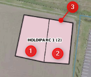

1 - Saisie du local 1 affecté au bâtiment Holdiparc 1

2 - Saisie du local 2 affecté au bâtiment Holdiparc 1

3 - Reconstruction du bâtiment Holdiparc 1. L'étiquette indique le nom du bâtiment et entre parenthèse le nombre de locaux affectés (ici 2)

