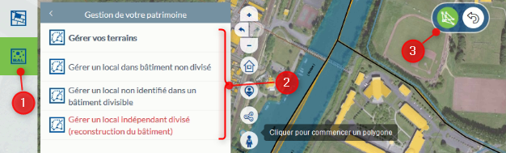

# Documentation utilisateur de l'application #

## Pour tous les utilisateurs :
- (non opérationnel)

## Pour les administrateurs : 

Cette documentation est spécifique aux personnes intégrant de la donnée, soit par l'intermédiaire de l'inventaire cartographique possible depuis l'application Web ou depuis le gabarit QGIS disponible [ici](https://github.com/sigagglocompiegne/marcheimmoent/blob/master/gabarit/livrables.md). Les compléments métiers des biens du marché de l'immobilier d'entreprises sont assurés par le service métier concerné.

**La modification de l'inventaire**

Si le bien est déjà saisi, l'accès à ces informations pour compléments ou ajouts d'informations (média, occupants, locaux éventuels pour les bâtiments concernés) est possible par simple clic sur l'objet à partir de la carte. Ce fonctionnel permet d'accéder de nouveau à la fiche d'informations pour la modifier.

**La suppression de l'inventaire**

Pour supprimer un objet saisi, un simple clic sur l'objet à partir de la carte vous ouvre la fiche d'informations. Rendez la fiche d'informations éditable en cliquant sur EDITER, puis cliquez sur SUPPRIMER. Le développement fonctionnel supprime automatiquement les objets et les informations liées de cette manière :
- pour un terrain : suppression classique de l'objet et des informations liées dans la base
- pour un local (Bâtiment non divisé) : suppression de l'objet et des informatiosn liées dans la base, y compris les information du bâtiment
- pour un local indépendant divisé : la suppression de tous les objets (ou locaux) appartenant à un même bâtiment supprime par défaut toutes les informations, y compris celles du bâtiment d'appartenance. Si il reste 1 local d'appartenance, les informations du bâtiment demeurent et le bâtiment est reconstruit virtuellement avec les locaux restant.
- pour un local non identifié dans un bâtiment divisible : chaque local attaché à un bâtiment peut-être suppprimé indivuellement. La suppression de tous les locaux n'entraine pas ici la suppression des informations du bâtiment. Pour supprimer définitivement ces informations, il faut EDITER la fiche et cliquer sur SUPPRIMER.

**La saisie de l'inventaire**

Le développement fonctionnel de l'inventaire cartographique priviligie l'accès par type de biens. Vous trouverez ci-dessous les différents choix possibles. 

1 - Cliquez sur le module métier pour accéder aux diverses fonctoins de gestion de l'inventaire

2 - Cliquez sur le sous-menu `Gestion de votre patrimoine` et choissisez le type d'objets à saisir

3 - Cliquez sur l'outil de dessin (ici polygon topologique)

Les options liées aux dessins (saisie, accroche, ...) sont détaillées au niveau du tutoriel [Dessiner et Annoter](https://geo.compiegnois.fr/portail/index.php/2020/06/16/les-outils-de-dessin/) et du tutoriel [Dessiner en mode avancé](https://geo.compiegnois.fr/portail/index.php/2020/06/13/les-outils-de-dessin-avances/)

#### Choix 1 - Saisir un bien immobilier de type terrain

Particularité(s) à noter :
* 
* 

#### Choix 2 - Saisir un bien immobilier de type local correspondant à un bâtiment : Local (Bâtiment non divisé)

#### Choix 3 - Saisir un bien immobilier de type bâitment contenant n locaux non identifiés : Local non identifié dans un bâtiment divisible

#### Choix 4 - Saisir un bien immobilier de type local identifié recomponsant virtuellement le bâtiment d'activité : Local indépendant divisé

