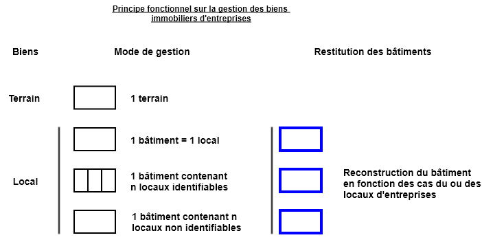

# Prescriptions spécifiques (locales) pour le suivi du marché de l'immobilier d'entreprises

# Documentation du standard

# Changelog

- 19/01/2021 : description initiale du gabarit de production des bâtiments d'activités et des locaux les composant.

# Livrables

Le gabarit présenté ci-après s'organise autour de la production d'un inventaire cartographique des bâtiments d'activités et des locaux les composant dans les zones d'activités en priorité pour un déploiement progressif à moyen ou long terme en centre-ville. 
L'objectif principal est bien de recenser l'ensemble des objets participant à la structuration 
des locaux d'activité. En les typant par une nomenclature simple et compréhensible, cet inventaire peut-être
produit par un nom spécialiste.
Néanmoins pour les besoins d'un service gérant les locaux d'activité, ce gabarit a été pensé pour deux autres usages : l'un permettant
de détailler ces objets d'un point de vue métier et un autre dans une optique de connaissance du marché immobilier et proposer des biens à des entreprises.
Cet inventaire sera ainsi intégré à la base de données de la collectivité et pourra être également complété et mis à jour par le service métier à moyen et long terme.

## Gabarits

- Fichier gabarit Qgis 3.x (vierge) complet à télécharger (en cours de réalisation)

## Principe fonctionnel

Schéma 1 : représentation des objets de l'inventaire cartographique

## Règle de modélisation

### Règles générales

Les objets constituant l'inventaire cartographique initial sont organisés autour d'une seule primitive graphique de type polygone. 
**La saisie des objets de type multi est autorisée.**

La saisie de ces objets doit permettre une restitution de l'ordre du 1 000ème.

Les objets produits dans le cadre de cet inventaire devront être en cohérence topologique avec la précision des bâtiments du PCI Vecteur.

### La modélisation

Les règles de modélisation consistent à présenter la façon dont les objets doivent être saisis et restitués dans le gabarit.

Ici ils sont simples, un polygone représente au moins un local, qu'il correspond à un bâtiment ou constitue un bâtiment par regroupement. Un bâtiment regroupant n locaux non identifiés sera représenté par un polygone. Il n'y a pas de limites de surfaces pour la représentation d'un objet. Ils doivent simplement représenter une activité économique.

Les locaux identifiés permettant la reconstruction virtuel du bâtiment d'activités devront être obligatoirement adjacents.

### Topologie

La cohérence topologique impose le partage de géométrie et donc l’utilisation des outils « d’accroches ».

- les objets peuvent être à cheval sur plusieurs communes,
- les objets peuvent appartenir à une site d'activités.

- Tous les objets de type "surface" sont des polygones fermés, et si ils sont adjacents, ils devront être topologique (absence de chevauchements et de micro-trous). 

 

- Un polygone contenant un autre polygone devra être découpé avec celui-ci.

### Système de coordonnées

Les coordonnées seront exprimées en mètre avec trois chiffres après la virgule dans le système national en vigueur.
Sur le territoire métropolitain s'applique le système géodésique français légal RGF93 associé au système altimétrique IGN69. La projection associée Lambert 93 France (epsg:2154) sera à utiliser pour la livraison des données.

## Format des fichiers

Les fichiers sont disponibles au format ESRI Shape (.SHP) contenant la géométrie.
L'encodage des caractères est en UTF8. Les différents supports sont téléchargeables dans la rubrique Gabarits.

## Description des classes d'objets

|Nom fichier|Définition|Catégorie|Géométrie|
|:---|:---|:---|:---|
|geo_v_immo_bien_terrain|Localisation des terrains|Inventaire cartographique|Polygone|
|geo_v_immo_bien_locunique|Localisation des locaux correspondant à un unique bâtiment|Inventaire cartographique|Polygone|
|geo_v_immo_bien_locnonident|Localsiation du bâtiment contenant n locaux|Inventaire cartographique|Polygone|
|an_v_immo_bien_locnonident|Inventaire cartographique|sans géométrie (utilise la géométrie de geo_v_immo_bien_locnonident en relation n..m)|
|geo_v_immo_bien_locident|Localisation des locaux identifiés permettant la reconstruction du bâtiment d'activité|Inventaire cartographique|Polygone|

## Implémentation informatique

### Patrimoine

Ensemble des données décrivant les objets composant l'inventaire cartographique du marché de l'immobilier d'entreprises. 

`geo_v_immo_bien_terrain` : fichier contenant les objets "terrain" de type surfacique. Même si ces objets ne rentrent pas dans l'inventaire du patrimoine des bâtiments d'activités, celui-ci est présenté pour information.

|Nom attribut|Définition|Type|Valeurs|Contraintes|Observations|
|:---|:---|:---|:---|:---|:---|
|idimmo|identifiant de l'objet|text|O[n° incrémenté]||Incrémentation automatique par le gabarit|
|ityp|type d'occupation|character varying(2)|Liste de valeurs (lt_immp_ityp)|Non Null forcé à la valeur '10'|Non modifiable dans le gabarit|
|libelle|Libellé du bien|character varying(254)||||
|op_sai|Opérateur de saisie|character varying(25)||||
|date_sai|Date de saisie|date|now()||Non modifiable dans le gabarit|
|date_maj|Date de mise à jour|date||||
|src_geom|Référentiel géographique utilisé pour la saisie|character varying(2)|Liste de valeurs (lt_src_geom)|Valeur '11' (PCI Vecteur) par défaut||
|src_date|Année du référentiel géographique utilisé pour la saisie|integer||||
|insee|Code insee de la ou des commune(s) d'emprise|character varying(25)||||
|commune|Libellé de la ou des commune(s) d'emprise|character varying(160)||||
|adr|Adresse du bien|character varying(254)||||
|adrcomp|Complément d'adresse|character varying(254)||||
|sup_m²|Surface en m² de l'objet saisi|integer|$area||Non modifiable dans le gabarit|
|observ|Observations|character varying(254)||||

`geo_v_immo_bien_locunique` : fichier contenant les objets "locaux" correspondant au bâtiment de type surfacique.

|Nom attribut|Définition|Type|Valeurs|Contraintes|Observations|
|:---|:---|:---|:---|:---|:---|
|idimmo|identifiant de l'objet|text|O[n° incrémenté]||Incrémentation automatique par le gabarit|
|ityp|type d'occupation|character varying(2)|Liste de valeurs (lt_immp_ityp)|Non Null forcé à la valeur '10'|Non modifiable dans le gabarit|
|tbien|type de biens|character varying(2)|Liste de valeurs (lt_immp_tbien(21))|Non Null||
|lib_bati|Libellé du bâti|character varying(254)||Non Null||
|libelle|Libellé du bien|character varying(254)||||
|op_sai|Opérateur de saisie|character varying(25)||||
|date_sai|Date de saisie|date|now()||Non modifiable dans le gabarit|
|date_maj|Date de mise à jour|date||||
|src_geom|Référentiel géographique utilisé pour la saisie|character varying(2)|Liste de valeurs (lt_src_geom)|Valeur '11' (PCI Vecteur) par défaut||
|src_date|Année du référentiel géographique utilisé pour la saisie|integer||||
|insee|Code insee de la ou des commune(s) d'emprise|character varying(25)||||
|commune|Libellé de la ou des commune(s) d'emprise|character varying(160)||||
|adr|Adresse du bien|character varying(254)||||
|adrcomp|Complément d'adresse|character varying(254)||||
|sup_m²|Surface en m² de l'objet saisi|integer|$area||Non modifiable dans le gabarit|
|observ|Observations|character varying(254)||||

`geo_v_immo_bien_locnonident` : fichier contenant les objets "bâtiment" contenant n locaux non identifiés de type surfacique

|Nom attribut|Définition|Type|Valeurs|Contraintes|Observations|
|:---|:---|:---|:---|:---|:---|

`an_v_immo_bien_locnonident` : fichier contenant les attributs spécifiques des "locaux" non identifiés dans un même bâtiment utilisant la géométrie précédente de type surfacique (jointure n..m dans le projet QGIS)

|Nom attribut|Définition|Type|Valeurs|Contraintes|Observations|
|:---|:---|:---|:---|:---|:---|

`geo_v_immo_bien_locident` : fichier contenant les objets "locaux" identifiés de type surfacique reconstruisant dynamiquement les bâtiments.

|Nom attribut|Définition|Type|Valeurs|Contraintes|Observations|
|:---|:---|:---|:---|:---|:---|

### Liste de valeurs

Le contenu des listes de valeurs est disponible dans la documentation complète de la base de données en cliquant [ici](/bdd/doc_admin_bd_ev.md) dans la rubrique `Liste de valeurs`.

### Les identifiants

Les identifiants des objets des espaces verts sont des identifiants non signifiants (un simple numéro incrémenté de 1 à chaque insertion précédé d'une lettre indiquant le type d'objets).

